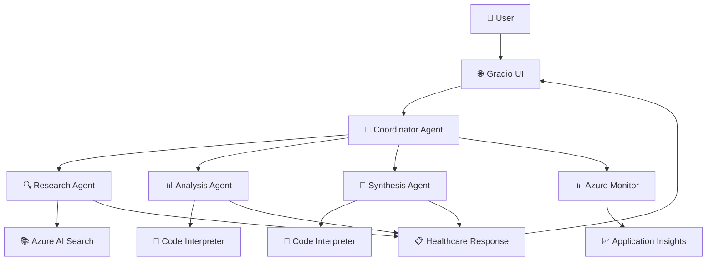
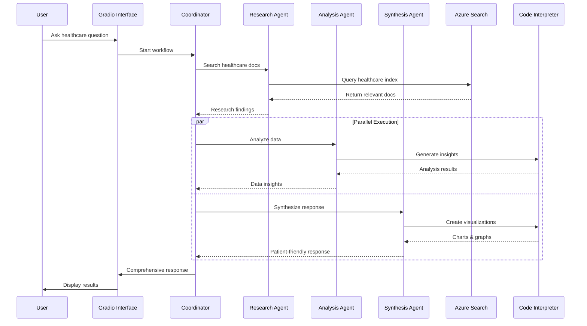

# 🏥 Healthcare Agentic RAG System

A production-ready multi-agent healthcare AI system with Azure AI Foundry integration and comprehensive monitoring.

## 🏗️ Architecture



## 🔄 User Flow



## 🚀 Quick Start

### 1. Setup Environment
```bash
# Copy configuration template
cp config.env.example .env

# Edit .env with your Azure credentials
# - AZURE_AI_FOUNDRY_ENDPOINT
# - AZURE_AI_FOUNDRY_API_KEY  
# - AZURE_SEARCH_* settings
# - APPLICATIONINSIGHTS_CONNECTION_STRING
```

### 2. Install & Run
```bash
# Create and activate virtual environment
python -m venv venv
source venv/bin/activate  # On Windows: venv\Scripts\activate

# Install dependencies
pip install -r requirements.txt

# Run the application
python app.py
```

### 3. Access Interface
Open http://localhost:7860 and ask healthcare questions like:
- "What are the symptoms of diabetes?"
- "How is hypertension treated?"
- "What are the side effects of metformin?"

## 🎯 Features

- **🔍 Research Agent**: Azure AI Search for healthcare documents
- **📊 Analysis Agent**: Code Interpreter for data insights  
- **📝 Synthesis Agent**: Patient-friendly responses with visualizations
- **📈 Monitoring**: Azure Monitor Application Insights integration
- **⚡ Parallel Execution**: Optimized 30-40 second response time
- **🌙 Dark Theme**: Modern, accessible interface

## 📊 Monitoring

View comprehensive traces in:
- **Azure AI Foundry Portal** → Monitoring → Application analytics
- **Azure Monitor** → Application Insights dashboard

## 📁 Project Structure

```
agentic_rag/
├── agents/           # Multi-agent system
├── monitoring/       # Azure Monitor integration  
├── utils/           # Utilities
├── app.py           # Main application
└── config.env.example
```

## 🔧 Configuration

Required environment variables in `.env`:
- `AZURE_AI_FOUNDRY_ENDPOINT` - Your Azure AI Foundry endpoint
- `AZURE_AI_FOUNDRY_API_KEY` - Your API key
- `AZURE_SEARCH_*` - Azure AI Search configuration
- `APPLICATIONINSIGHTS_CONNECTION_STRING` - Monitoring connection

---

**Built with ❤️ for healthcare professionals and patients**