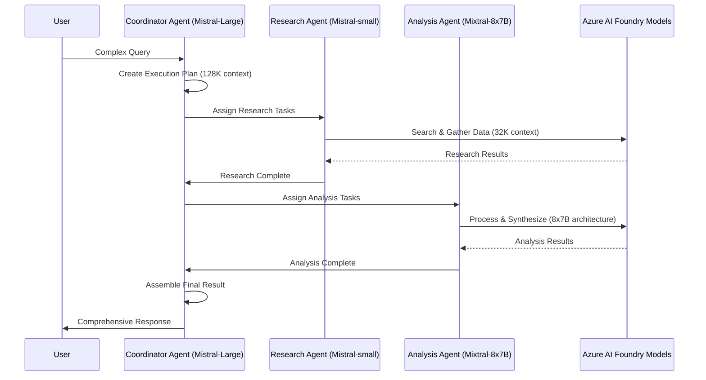

# 🚀 Agentic RAG: Production-Ready AI Agent System

A **sophisticated multi-agent AI system** built with Azure AI Foundry models, demonstrating how startups can evolve from simple MVP RAG to enterprise-grade intelligent agents using the best available AI models.

## 🎯 What This Demonstrates

- **AI Agent Evolution**: From simple Q&A to intelligent problem-solving agents
- **Azure AI Foundry Power**: Access to best-in-class models (Mistral, Mixtral, DeepSeek)
- **Multi-Agent Collaboration**: How AI agents work together like human teams
- **Production Readiness**: Scalable, secure, compliant architecture
- **Business Value**: Real workflows that save time and money
- **Cost Optimization**: Smart model selection for different tasks

## 🏗️ Architecture & Agent Communication

```
                    🎨 Gradio Web Interface
                           ↓
                    🤖 Coordinator Agent
                    (Mistral-Large-2411)
                           ↓
              ┌─────────────────────────────┐
              ↓                             ↓
        🔍 Research Agent           📊 Analysis Agent
      (Mistral-small-2503)      (Mixtral-8x7B-Instruct)
              ↓                             ↓
        🛠️ Azure AI Search         📄 Mistral-OCR-2503
        🕷️ Web Search Tools        🔍 Pattern Recognition
        📄 Document Processing     🖼️ Stable Diffusion 3.5
              ↓                             ↓
                    🤖 Coordinator Agent
                    (Final Assembly)
                           ↓
                    📊 Comprehensive Response
```

### **Agent Communication Flow:**



## 🚀 Tech Stack

### **Frontend & UI:**
- **Gradio**: Same beautiful interface as MVP RAG
- **React Components**: Enhanced workflow visualization
- **Real-time Updates**: Live agent communication display

### **Agent Orchestration:**
- **LangGraph**: Multi-agent workflow management
- **LangChain**: Tool integration and agent communication
- **Azure AI Agent Service**: Enterprise agent capabilities

### **Azure AI Foundry Models:**
- **Mistral-Large-2411**: Coordinator agent (128K context, multilingual, tool calling)
- **Mistral-small-2503**: Research agent (32K context, fast, cost-effective)
- **Mixtral-8x7B-Instruct**: Analysis agent (superior synthesis capabilities)
- **Mistral-OCR-2503**: Document processing (PDF support, 1000 pages, 50MB max)
- **Stable Diffusion 3.5**: Image generation and visual analysis

### **Azure AI Services:**
- **Azure AI Search**: Enterprise document retrieval (MCP)
- **Azure AI Foundry**: Model monitoring, optimization, cost control
- **Azure Content Safety**: Guardrails and compliance
- **Azure Monitor**: Performance and health monitoring

### **Data & Storage:**
- **Azure Blob Storage**: Document storage and management
- **Azure Cosmos DB**: Conversation history and state
- **Azure Monitor**: Performance and health monitoring
- **Azure Key Vault**: Security and compliance

## 🔄 User Flow

### **1. 🎯 User Input**
```
User asks: "Research the latest developments in diabetes treatment, 
analyze the uploaded research paper, and create a comprehensive summary report"
```

### **2. 🤖 Coordinator Agent Planning (Mistral-Large-2411)**
```
Coordinator analyzes request and creates execution plan:
├── Phase 1: Research & Data Collection (Mistral-small-2503)
├── Phase 2: Document Analysis & Processing (Mistral-OCR-2503)
├── Phase 3: Information Synthesis & Analysis (Mixtral-8x7B)
└── Phase 4: Report Generation & Validation (Mistral-Large-2411)
```

### **3. 🔍 Research Agent Execution (Mistral-small-2503)**
```
Research Agent executes multiple tasks:
├── Search Azure AI Search for recent diabetes research
├── Fetch latest medical papers via web search
├── Process uploaded research document
├── Collect relevant clinical trial data
└── Gather regulatory and compliance information
```

### **4. 📊 Analysis Agent Processing (Mixtral-8x7B-Instruct)**
```
Analysis Agent synthesizes and analyzes:
├── Compare research findings across sources
├── Identify key trends and breakthroughs
├── Analyze clinical trial results
├── Assess regulatory implications
└── Generate insights and recommendations
```

### **5. 🤖 Coordinator Final Assembly (Mistral-Large-2411)**
```
Coordinator assembles comprehensive response:
├── Executive Summary
├── Detailed Research Analysis
├── Key Findings & Insights
├── Recommendations & Next Steps
├── Source Citations & References
└── Compliance & Safety Notes
```

### **6. 📊 Response & Monitoring**
```
Final delivery with enterprise features:
├── Comprehensive Report
├── Performance Metrics (Azure AI Foundry)
├── Cost Analysis (per model usage)
├── Compliance Validation
└── Audit Trail
```

## 🎭 Demo Scenarios

### **Scenario 1: Medical Research Assistant**
```
User: "Upload this diabetes research paper and compare it with the latest findings"
Agent Team:
├── Research Agent (Mistral-small-2503) → Searches latest research + processes uploaded paper
├── Analysis Agent (Mixtral-8x7B) → Compares findings + identifies differences
└── Coordinator (Mistral-Large-2411) → Creates comprehensive comparison report
```

### **Scenario 2: Compliance & Risk Assessment**
```
User: "Review these medical documents for compliance and identify potential risks"
Agent Team:
├── Research Agent (Mistral-small-2503) → Analyzes documents + checks regulations
├── Analysis Agent (Mixtral-8x7B) → Identifies compliance issues + risk factors
└── Coordinator (Mistral-Large-2411) → Generates compliance report with recommendations
```

### **Scenario 3: Market Intelligence & Strategy**
```
User: "Analyze our healthcare market position and identify growth opportunities"
Agent Team:
├── Research Agent (Mistral-small-2503) → Gathers market data + competitive intelligence
├── Analysis Agent (Mixtral-8x7B) → Analyzes trends + identifies opportunities
└── Coordinator (Mistral-Large-2411) → Creates strategic analysis report
```

## 🔧 Key Features

### **Intelligent Workflow Management:**
- **Multi-step Reasoning**: Complex problem decomposition using Mistral-Large-2411
- **Dynamic Planning**: Adapts based on available information
- **Progress Tracking**: Real-time workflow visualization
- **Error Handling**: Graceful fallbacks and recovery

### **Enterprise AI Capabilities:**
- **Document Intelligence**: Advanced document processing with Mistral-OCR-2503
- **Multi-source Synthesis**: Combines information intelligently with Mixtral-8x7B
- **Compliance & Safety**: Built-in guardrails and validation
- **Performance Monitoring**: Real-time optimization with Azure AI Foundry

### **Production-Ready Architecture:**
- **Auto-scaling**: Handles multiple users and workloads
- **Security**: Role-based access and encryption
- **Compliance**: HIPAA, GDPR, and industry standards
- **Monitoring**: Comprehensive observability and alerting

## 🚀 Evolution Path from MVP

| Feature | MVP RAG | Agentic RAG |
|---------|---------|--------------|
| **Architecture** | Single RAG Pipeline | Multi-Agent Collaboration |
| **Capabilities** | Q&A Only | Complex Problem Solving |
| **Tools** | Local Ollama + Qdrant | Azure AI Foundry Models + MCP |
| **Document Processing** | Basic Text Search | Advanced AI Document Analysis |
| **Workflow** | One-shot Response | Multi-step Planning & Execution |
| **Monitoring** | Basic Metrics | Enterprise AI Foundry Insights |
| **Scalability** | Single User | Multi-tenant, Auto-scaling |
| **Compliance** | None | Built-in Safety & Governance |
| **Model Selection** | Single Local Model | Optimized Azure AI Foundry Models |
| **Cost Optimization** | Fixed Local Cost | Smart Model Selection & Monitoring |

## 💰 Cost Optimization with Azure AI Foundry

### **Smart Model Selection Strategy:**
```
Task Complexity → Model Selection → Cost Optimization
├── Simple Tasks → Mistral-small-2503 → Lowest cost
├── Medium Tasks → Mixtral-8x7B → Medium cost
├── Complex Tasks → Mistral-Large-2411 → Higher cost
└── Document Processing → Mistral-OCR-2503 → Specialized cost
```

### **Monthly Cost Estimate (1000 queries):**
```
Mistral-small-2503 (Research): $5-10/month
Mixtral-8x7B (Analysis): $15-25/month
Mistral-Large-2411 (Planning): $25-40/month
Mistral-OCR-2503 (Documents): $10-15/month
Total: $55-90/month (vs. $150-300+ with OpenAI-only)
```

### **Azure AI Foundry Benefits:**
- **Model Comparison**: A/B test different models for each task
- **Performance Monitoring**: Track model efficiency and cost
- **Cost Tracking**: Real-time usage and cost monitoring
- **Optimization**: Automatic model selection based on performance

## 🎯 Business Value for Startups

### **Immediate Benefits:**
- **Faster Problem Solving**: Complex tasks completed in minutes
- **Better Insights**: AI-powered analysis and synthesis
- **Cost Reduction**: Smart model selection and optimization
- **Competitive Advantage**: Enterprise-grade AI capabilities

### **Long-term Growth:**
- **Scalable Architecture**: Grows with your business
- **Enterprise Ready**: Built-in compliance and security
- **AI-First Strategy**: Foundation for future AI initiatives
- **Market Differentiation**: Advanced AI capabilities

## 🚀 Quick Start

### **Prerequisites:**
- Azure subscription with AI services
- Python 3.9+ environment
- Azure CLI configured
- Access to Azure AI Foundry

### **Setup & Run:**
```bash
# 1. Navigate to agentic_rag folder
cd agentic_rag

# 2. Install dependencies
pip install -r requirements.txt

# 3. Configure Azure credentials
az login
az account set --subscription <your-subscription>

# 4. Set environment variables
cp .env.example .env
# Edit .env with your Azure AI Foundry model endpoints

# 5. Launch the enhanced Gradio UI
python app.py
```

🌐 **Open your browser**: `http://localhost:7860`

## 📁 Project Structure

```
agentic_rag/
├── core/                    # Core agent components
│   ├── agent_orchestrator.py  # Main agent coordinator (Mistral-Large)
│   ├── research_agent.py      # Research agent (Mistral-small)
│   ├── analysis_agent.py      # Analysis agent (Mixtral-8x7B)
│   ├── azure_client.py        # Azure AI Foundry client
│   └── vector_store.py        # Azure AI Search integration
├── data/                    # Data and tools
│   ├── ingest.py            # Document ingestion
│   └── tools/               # Agent tools (MCP, web search, etc.)
├── utils/                   # Utilities and logging
├── app.py                   # Enhanced Gradio UI
├── requirements.txt         # Azure AI Foundry dependencies
└── README.md               # This file
```

## 🔮 Future Enhancements

### **Phase 2: Advanced Model Capabilities**
- **Model Switching**: Dynamic model selection based on task complexity
- **Performance Optimization**: A/B testing different model combinations
- **Cost Monitoring**: Real-time cost tracking and optimization
- **Custom Fine-tuning**: Domain-specific model optimization

### **Phase 3: Enterprise Integration**
- **CRM Integration**: Salesforce, HubSpot connectivity
- **ERP Systems**: SAP, Oracle integration
- **Custom APIs**: Industry-specific data sources
- **Multi-tenant Support**: Enterprise deployment capabilities

### **Phase 4: Advanced Analytics**
- **Predictive Insights**: Future trend forecasting
- **Business Intelligence**: Advanced reporting and dashboards
- **Performance Optimization**: AI-powered system tuning
- **Cost Analytics**: Detailed cost breakdown and optimization

---

## 🎯 What This Demonstrates

This system shows startups exactly how to evolve from:
- **Simple MVP** → **Intelligent AI Agents**
- **Local Tools** → **Azure AI Foundry Models**
- **Basic Q&A** → **Complex Problem Solving**
- **Single Pipeline** → **Multi-Agent Collaboration**
- **Development Demo** → **Production-Ready System**
- **Fixed Costs** → **Smart Cost Optimization**

---

*Built with ❤️ for demonstrating AI evolution from MVP to enterprise-grade AI agents using Azure AI Foundry*
