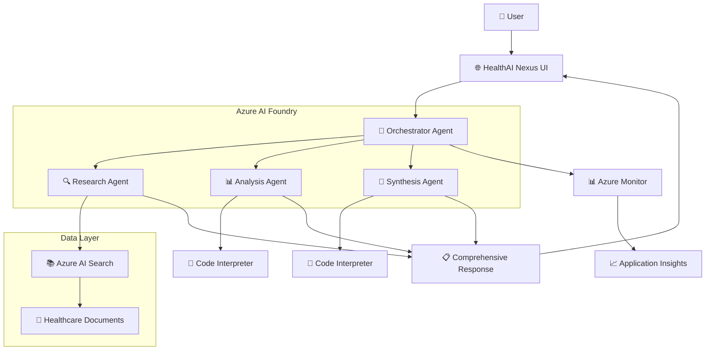
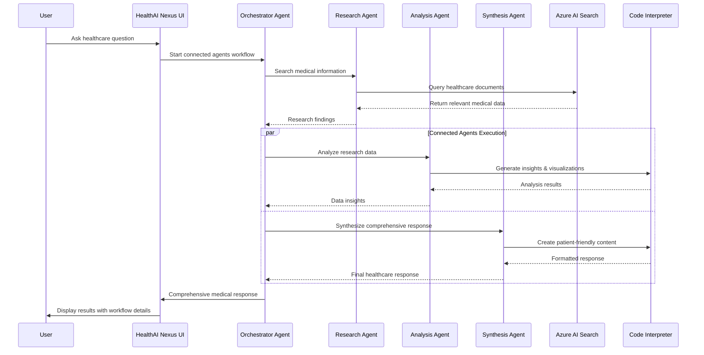

# 🏥 HealthAI Nexus

An intelligent healthcare AI system powered by Azure AI Foundry Connected Agents, providing comprehensive medical information through coordinated multi-agent workflows.

## 🏗️ Architecture



## 🔄 User Flow



## 🚀 Quick Start

### 1. Setup Environment
```bash
# Create and activate virtual environment
python -m venv venv
source venv/bin/activate  # On Windows: venv\Scripts\activate

# Install dependencies
pip install -r requirements.txt

# Copy configuration template
cp config.env.example .env

# Edit .env with your Azure credentials
# - AZURE_AI_FOUNDRY_ENDPOINT
# - AZURE_AI_FOUNDRY_API_KEY  
# - AZURE_SEARCH_* settings
# - APPLICATIONINSIGHTS_CONNECTION_STRING
```

### 2. Setup Azure AI Search & Data
```bash
# Create Azure AI Search index and ingest healthcare data
python data/setup_complete.py
```

This will:
- ✅ Create the Azure AI Search index with proper schema
- ✅ Ingest sample healthcare documents (diabetes, heart disease, COVID-19, etc.)
- ✅ Test the search functionality
- ✅ Display index statistics

### 3. Run the Application
```bash
# Run the standard version
python app.py


### 4. Access Interface
- http://localhost:7860

Ask healthcare questions like:
- "What are the symptoms of diabetes?"
- "How is hypertension treated?"
- "What are the side effects of metformin?"
- "Explain COVID-19 vaccination guidelines"

## 🎯 Features

### Core Capabilities
- **🔍 Research Agent**: Azure AI Search for comprehensive healthcare documents
- **📊 Analysis Agent**: Code Interpreter for data insights and visualizations  
- **📝 Synthesis Agent**: Patient-friendly responses with medical summaries
- **🎯 Orchestrator Agent**: Coordinates connected agents workflow


## 📊 Monitoring

View comprehensive traces in:
- **Azure AI Foundry Portal** → Monitoring → Application analytics
- **Azure Monitor** → Application Insights dashboard

## 📁 Project Structure

```
agentic_rag/
├── agents/              # Connected agents system
│   ├── research_agent.py
│   ├── analysis_agent.py
│   ├── synthesis_agent.py
│   └── orchestrator_agent.py
├── data/                # Azure AI Search setup & data ingestion
│   ├── setup_azure_search.py
│   ├── ingest_healthcare_data.py
│   └── setup_complete.py
├── tests/               # Test suite
│   ├── test_azure_search.py
│   ├── test_research_agent.py
│   └── run_all_tests.py
├── monitoring/          # Azure Monitor integration  
├── app.py              # Main application
├── app_enhanced.py     # Enhanced version with advanced features
└── config.env.example
```

## 🔧 Configuration

Required environment variables in `.env`:
- `AZURE_AI_FOUNDRY_ENDPOINT` - Your Azure AI Foundry endpoint
- `AZURE_AI_FOUNDRY_API_KEY` - Your API key
- `AZURE_SEARCH_ENDPOINT` - Azure AI Search service endpoint
- `AZURE_SEARCH_KEY` - Azure AI Search service key
- `AZURE_SEARCH_INDEX_NAME` - Search index name (default: healthcare-documents)
- `APPLICATIONINSIGHTS_CONNECTION_STRING` - Monitoring connection

## 🧪 Testing

Run the complete test suite:
```bash
# Test all components
python tests/run_all_tests.py

# Test individual components
python tests/test_azure_search.py
python tests/test_research_agent.py
python tests/test_analysis_agent.py
python tests/test_synthesis_agent.py
python tests/test_end_to_end_flow.py
```

## 📊 Data Management

### Setup Azure AI Search
```bash
# Complete setup (recommended)
python data/setup_complete.py

# Individual setup steps
python data/setup_azure_search.py    # Create index
python data/ingest_healthcare_data.py # Ingest data
```

### Sample Healthcare Documents
The system includes comprehensive healthcare documents covering:
- **Diabetes Management** - Symptoms, treatment, and management
- **Heart Disease Prevention** - Risk factors and prevention strategies  
- **COVID-19 Vaccination** - Safety, efficacy, and guidelines
- **Mental Health & Anxiety** - Treatment options and self-care
- **Pregnancy Care** - Prenatal health and guidelines
- **Blood Pressure Management** - Hypertension treatment

---

**Built with ❤️ for healthcare professionals and patients using Azure AI Foundry Connected Agents**