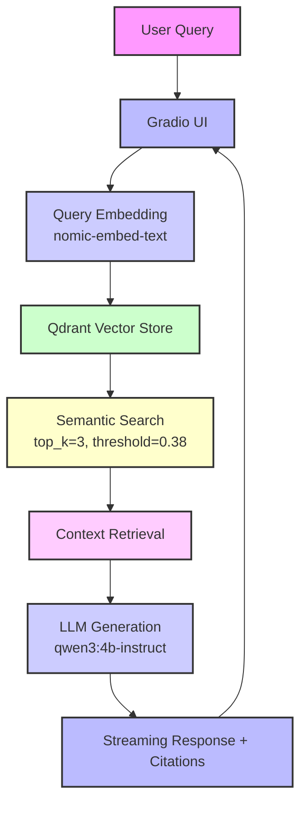

# 🏥 MVP RAG Healthcare AI Assistant

Minimal Retrieval‑Augmented Generation demo using local tools.

## 🎯 What This Demonstrates

- **MVP RAG System**: Not just a demo - actual semantic search with embeddings
- **Local AI Stack**: Ollama + Qdrant for cost-effective development
- **Production Patterns**: Proper architecture, error handling, and monitoring
- **Healthcare Focus**: Domain-specific AI assistant with medical disclaimers

## 🏗️ Architecture



## 🚀 Quick Start

### Step 1: Clone the Repository
```bash
git clone <your-repo-url>
cd h100-growthx-fy26
```

### Step 2: Install Prerequisites
```bash
# Install Docker Desktop (if not already installed)
# Download from: https://www.docker.com/products/docker-desktop/

# Install Ollama (if not already installed)
# Download from: https://ollama.ai/
```

### Step 3: Setup Python Environment
```bash
# Create virtual environment
python -m venv venv

# Activate virtual environment
# On macOS/Linux:
source venv/bin/activate
# On Windows:
# venv\Scripts\activate

# Install dependencies
pip install -r mvp_rag/requirements.txt
```

### Step 4: Download Required AI Models
```bash
# Pull required Ollama models
ollama pull qwen3:4b-instruct    # For text generation
ollama pull nomic-embed-text      # For embeddings
```

### Step 5: Start Qdrant Vector Database
```bash
# Stop any existing Qdrant container
docker rm -f qdrant 2>/dev/null || true

# Start Qdrant container
docker run -d --name qdrant -p 6333:6333 -p 6334:6334 qdrant/qdrant

# Wait a few seconds for Qdrant to start
sleep 5
```

### Step 6: Ingest Sample Healthcare Documents
```bash
# Navigate to MVP RAG directory
cd mvp_rag

# Ingest sample healthcare documents into Qdrant
python data/ingest.py
```

### Step 7: Launch the Healthcare AI Assistant
```bash
# Start the Gradio web interface
python app.py
```

### Step 8: Access the Application
🌐 **Open your browser**: http://localhost:7860

## 🎯 Demo Features

### Example Queries to Test:
- **🩺 Diabetes Symptoms**: "What are the common symptoms of diabetes?"
- **💊 Blood Pressure Meds**: "What are the different types of blood pressure medications?"
- **🫀 Heart Attack Signs**: "What are the warning signs of a heart attack?"
- **🦠 COVID-19 Guidelines**: "What are the current COVID-19 vaccination guidelines?"
- **🧠 Mental Health Support**: "What are signs of depression and when should I seek help?"
- **👶 Pregnancy Care**: "What are important prenatal care guidelines?"

### What You'll See:
1. **Beautiful Gradio UI** with healthcare-themed design
2. **Real-time AI responses** with medical disclaimers
3. **Retrieved documents** with similarity scores
4. **Performance metrics** showing processing times
5. **Proper citations** for all medical information

## 📁 Project Structure

```
mvp_rag/
├── core/                    # Core RAG components
│   ├── llm_client.py       # Ollama client for LLM & embeddings
│   ├── vector_store.py     # Qdrant vector database client
│   └── rag_engine.py       # Main RAG orchestration engine
├── data/                    # Data ingestion scripts
│   └── ingest.py           # Sample healthcare documents
├── utils/                   # Utilities and logging
├── app.py                   # Gradio web interface
├── requirements.txt         # Python dependencies
└── README.md               # This file
```

## 🔧 Key Features

- **Smart Retrieval**: Top-3 most relevant documents with similarity threshold
- **Streaming UI**: Progressive response display for better UX
- **Performance Metrics**: Real-time timing and search analytics
- **Medical Safety**: Built-in disclaimers and professional consultation guidance
- **Auto-scaling**: Vector size mismatch detection and collection recreation
- **Example Queries**: Pre-built test cases for easy demonstration

## 📊 Performance Optimizations

- **Embeddings**: `nomic-embed-text` for fast, accurate semantic search
- **Retrieval**: `top_k=3` with `score_threshold=0.38` for focused context
- **Generation**: Optimized prompts for concise, actionable responses
- **Pre-warming**: LLM initialization to reduce first-response latency

## 🎭 Demo Flow

1. **User enters health question** → Gradio interface
2. **Query gets embedded** → nomic-embed-text model
3. **Vector search** → Qdrant finds similar healthcare documents
4. **Context preparation** → Top 3 relevant documents selected
5. **LLM generation** → qwen3:4b-instruct creates response
6. **Response display** → Formatted with citations and disclaimers

## 🛠️ Troubleshooting

### Common Issues:
- **Ollama not running**: Start Ollama application
- **Qdrant connection failed**: Check Docker is running and Qdrant container is up
- **Models not found**: Run `ollama pull` commands for required models
- **Port 7860 in use**: Kill existing process or change port in app.py

### Health Checks:
```bash
# Check Ollama is running
curl http://localhost:11434/api/tags

# Check Qdrant is running
curl http://localhost:6333/health

# Check Python environment
python -c "import gradio; print('Gradio OK')"
```

## 🚀 Production Deployment

This MVP demonstrates local development patterns that can be extended to production:

- **Cloud Deployment**: Deploy to Azure, AWS, or GCP
- **Scalable Vector DB**: Use Pinecone, Weaviate, or managed Qdrant
- **Production LLMs**: Integrate with Azure OpenAI, Anthropic, or other providers
- **Monitoring**: Add Application Insights, CloudWatch, or similar
- **Security**: Implement authentication, rate limiting, and data encryption

---

**Built with ❤️ for Healthcare AI Innovation**
