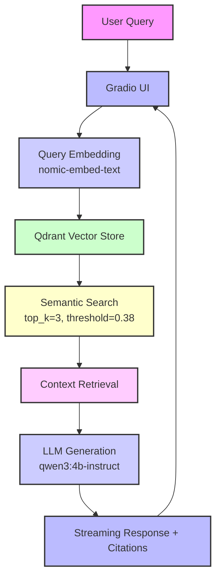

# 🏥 MVP RAG Healthcare AI Assistant

Minimal Retrieval‑Augmented Generation demo using local tools.

## 🎯 What This Demonstrates

- **MVP RAG System**: Not just a demo - actual semantic search with embeddings
- **Local AI Stack**: Ollama + Qdrant for cost-effective development
- **Production Patterns**: Proper architecture, error handling, and monitoring
- **Healthcare Focus**: Domain-specific AI assistant with medical disclaimers

## 🏗️ Architecture



## 🚀 Quick Start

### Prerequisites
- **Docker Desktop** running
- **Ollama** running with required models:
  ```bash
  ollama pull qwen3:4b-instruct    # For text generation
  ollama pull nomic-embed-text      # For embeddings
  ```

### Run the Demo
```bash
# 1. Activate virtual environment
source ./venv/bin/activate

# 2. Start Qdrant vector database
docker rm -f qdrant 2>/dev/null || true
docker run -d --name qdrant -p 6333:6333 -p 6334:6334 qdrant/qdrant

# 3. Ingest sample healthcare documents
python data/ingest.py

# 4. Launch the beautiful Gradio UI
python app.py
```

🌐 **Open your browser**: http://localhost:7860

## 📁 Project Structure

```
mvp_rag/
├── core/                    # Core RAG components
│   ├── llm_client.py       # Ollama client for LLM & embeddings
│   ├── vector_store.py     # Qdrant vector database client
│   └── rag_engine.py       # Main RAG orchestration engine
├── data/                    # Data ingestion scripts
│   └── ingest.py           # Sample healthcare documents
├── utils/                   # Utilities and logging
├── app.py                   # Gradio web interface
├── requirements.txt         # Python dependencies
└── README.md               # This file
```

## 🔧 Key Features

- **Smart Retrieval**: Top-3 most relevant documents with similarity threshold
- **Streaming UI**: Progressive response display for better UX
- **Performance Metrics**: Real-time timing and search analytics
- **Medical Safety**: Built-in disclaimers and professional consultation guidance
- **Auto-scaling**: Vector size mismatch detection and collection recreation

## 📊 Performance Optimizations

- **Embeddings**: `nomic-embed-text` for fast, accurate semantic search
- **Retrieval**: `top_k=3` with `score_threshold=0.38` for focused context
- **Generation**: Optimized prompts for concise, actionable responses
- **Pre-warming**: LLM initialization to reduce first-response latency

## 🎭 Demo Flow

1. **User enters health question** → Gradio interface
2. **Query gets embedded** → nomic-embed-text model
3. **Vector search** → Qdrant finds similar healthcare documents
4. **Context preparation** → Top 3 relevant documents selected
5. **LLM generation** → qwen3:4b-instruct creates response
6. **Streaming display** → Progressive response with citations
7. **Performance metrics** → Timing and search analytics shown

## 🚀 Evolution Path

This MVP demonstrates the foundation for:
- **Enterprise RAG**: Azure AI Search + OpenAI
- **AI Agents**: Azure Agent Service + tool integration
- **Production Monitoring**: Azure AI Foundry + observability
- **Content Safety**: Azure Content Safety + guardrails

---

*Built with ❤️ for demonstrating AI evolution from MVP to production*
